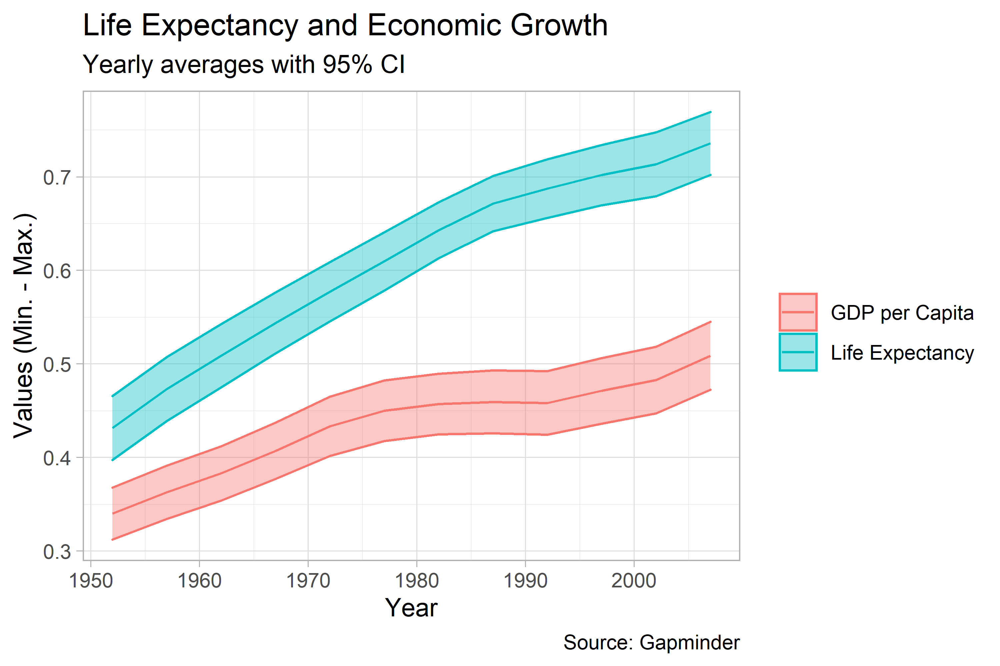

Ch. 3: Make a Plot
================

## Need Packages

``` r
library(tidyverse)
```

    ## -- Attaching packages --------------------------------------- tidyverse 1.3.1 --

    ## v ggplot2 3.3.6     v purrr   0.3.4
    ## v tibble  3.1.2     v dplyr   1.0.6
    ## v tidyr   1.1.3     v stringr 1.4.0
    ## v readr   1.4.0     v forcats 0.5.1

    ## Warning: package 'ggplot2' was built under R version 4.1.3

    ## -- Conflicts ------------------------------------------ tidyverse_conflicts() --
    ## x dplyr::filter() masks stats::filter()
    ## x dplyr::lag()    masks stats::lag()

``` r
library(here)
```

    ## Warning: package 'here' was built under R version 4.1.3

    ## here() starts at C:/Users/Miles/Documents/Denison University/Fall 2022/Data Vizualization/data-viz-fall-2022

``` r
library(socviz)
```

## What this chapter is about

This chapter focuses on the logic of plot building in R using `ggplot`.
We start with using the Gapminder dataset available from the `gapminder`
package:

``` r
library(gapminder)
```

    ## Warning: package 'gapminder' was built under R version 4.1.3

``` r
gapminder
```

    ## # A tibble: 1,704 x 6
    ##    country     continent  year lifeExp      pop gdpPercap
    ##    <fct>       <fct>     <int>   <dbl>    <int>     <dbl>
    ##  1 Afghanistan Asia       1952    28.8  8425333      779.
    ##  2 Afghanistan Asia       1957    30.3  9240934      821.
    ##  3 Afghanistan Asia       1962    32.0 10267083      853.
    ##  4 Afghanistan Asia       1967    34.0 11537966      836.
    ##  5 Afghanistan Asia       1972    36.1 13079460      740.
    ##  6 Afghanistan Asia       1977    38.4 14880372      786.
    ##  7 Afghanistan Asia       1982    39.9 12881816      978.
    ##  8 Afghanistan Asia       1987    40.8 13867957      852.
    ##  9 Afghanistan Asia       1992    41.7 16317921      649.
    ## 10 Afghanistan Asia       1997    41.8 22227415      635.
    ## # ... with 1,694 more rows

Let’s say we wanted to plot life expectancy by GDP per capita. We’ll do
this in several steps, highlighting the “grammar of graphics” that is
`ggplot`.

First, we tell `ggplot` the data we’re going to use:

``` r
p <- ggplot(data = gapminder)
```

We next need to provide `ggplot` with a “map” using the `aes()` function
(“aes” is short for aesthetics).

``` r
p <- p + aes(x = gdpPercap, y = lifeExp)
```

The above tells `ggplot` that we want the variable along the x-axis of
the plot to be GDP per capita and the variable along the y-axis to be
life expectancy.

Now, we can’t just stop here. If we print the results for `p` all we get
is an empty plot. No good!

``` r
p
```

<!-- -->

While we’ve told `ggplot` the data we’d like to use and drawn a map of
the variables we want to plot, we haven’t told `ggplot` the *kind* of
plot we want to produce. To do this we need to add a “layer” to the plot
with a `geom_` function. In these case, we’ll use `geom_point()` which
produces a scatter plot:

``` r
p + geom_point()
```

<!-- -->

## A workflow for drawing graphs

The types of graphs we can produce in R range from the simple to the
bizarre, but even the most complicated figures are created using a
workflow much like that used above:

1.  Tell `ggplot()` what our data is.
2.  Tell it what relationships we want to see using `aes()`.
3.  Tell `ggplot()` how we want these relationships plotted by layering
    on `geoms_`.

We can do much more, but this is the gist of it. There are other things
we can do to customize the axis labels, tick marks, plot title, etc. We
can even add multiple layers to plots.

Let’s build a base for a plot doing steps 1 and 2 again.

``` r
p <- ggplot(data = gapminder)
p <- p + aes(x = gdpPercap, y = lifeExp)
```

Next, instead of telling `ggplot` we want a scatter plot, let’s add
something that’s called a non-parametric smoother:

``` r
p + geom_smooth()
```

    ## `geom_smooth()` using method = 'gam' and formula 'y ~ s(x, bs = "cs")'

<!-- -->

The output informs us that `geom_smooth` has used a `method` called
`gam`, which stands for a generalized additive model. We can tell it to
use different kinds of methods if we so choose. For example, a simple
linear model:

``` r
p + geom_smooth(method = 'lm')
```

    ## `geom_smooth()` using formula 'y ~ x'

<!-- -->

Or we can specify a quadratic model by modifying the `formula` command:

``` r
p + geom_smooth(method = 'lm', formula = y ~ poly(x, 2))
```

<!-- -->

We can also choose to produce a scatter plot and then overlay a
smoother:

``` r
p + geom_point() + geom_smooth()
```

    ## `geom_smooth()` using method = 'gam' and formula 'y ~ s(x, bs = "cs")'

<!-- -->

We can also do things to try to clean up the data when presenting
relationships. Clearly, GDP per capita is not normally distributed. It
might be helpful to tell `ggplot` to apply a different scale, such as
log10 by using `scale_x_log10()`:

``` r
p + geom_point() +
  geom_smooth(method = 'lm', 
              formula = y ~ poly(x, 2)) +
  scale_x_log10()
```

<!-- -->

We can also modify how the axis tick mark values are labelled. In the
above, values are shown, but they’re in scientific notation (yuck!).
Thankfully, we can use the `scales` package to get `ggplot` to present
values in different formats. We can either load `scales` by writing
`library(scales)`, or if we’d rather just grab a particular function
from the package we can use the syntax `thepackage::thefunction` to get
what we need. We’ll do the latter to use the `dollar()` function, which
will report quantities as dollar amounts:

``` r
p + 
  geom_point() +
  geom_smooth(
    method = 'lm',
    formula = y ~ poly(x, 2)
  ) +
  scale_x_log10(
    labels = scales::dollar
  )
```

<!-- -->

All we did in the above was use one of the commands in
`scale_x_log10()`, in this case `labels` to pass information to `ggplot`
about the way we’d like the values along the x-axis to be presented.

## Mapping vs. Setting Aesthetics

A nice thing about `ggplot` is that we can plot data by different
categories using different colors, shapes, sizes, etc. When we do this,
it is important to draw a distinction between mapping aesthetics by type
versus giving `ggplot` direct instructions about how to draw data.

For instance, we can tell `ggplot` that we’d like to use different
colored points for different continents:

``` r
p <- ggplot(data = gapminder) + 
  aes(
    x = gdpPercap,
    y = lifeExp,
    color = continent
  )
p + geom_point()
```

<!-- -->

Alternatively, we tell `ggplot` to plot points as a particular color.

``` r
p + geom_point(color = 'firebrick')
```

<!-- -->

Note that you ***cannot write the following to set the color!***

``` r
p <- ggplot(data = gapminder) +
  aes(
    x = gdpPercap,
    y = lifeExp,
    color = 'firebrick'
  ) +
  geom_point()
p
```

<!-- -->

What gives?? All the data is a lighter color of read and the legend says
“colour” and lists “firebrick.” If you pass a color or any other value
that you want to set for the output rather than map, `ggplot` thinks
you’re wanting treat “redbrick” as a variable and it plots the data
accordingly.

The `aes()` function is for mappings only, not settings for the plot!

## More Customization

We can throw all sorts of customized options at `ggplot` for presenting
the data. And we can do these all at once. For example…

``` r
p <- ggplot(data = gapminder) +
  aes(
    x = gdpPercap,
    y = lifeExp,
    color = continent
  ) 
p + 
  geom_point(
    color = 'darkgrey'
  ) +
  geom_smooth(
    method = 'loess'
  ) +
  scale_x_log10(
    labels = scales::dollar
  ) +
  labs(
    x = "GDP per Capita",
    y = "Life Expectancy in Years",
    color = NULL,
    title = "Economic Growth and Life Expectancy",
    subtitle = "Data points are country-years",
    caption = "Source: Gapminder"
  ) +
  theme_light()
```

    ## `geom_smooth()` using formula 'y ~ x'

<!-- -->

## Adding in additional dimensions

This isn’t in Healy’s set of examples for Chapter 3, but I’m like a fly
to honey when it comes to this stuff. Let’s present the data over time
and see how GDP per capita and life expectancy move in parallel.

``` r
stand <- function(x) (x - min(x)) / max(x - min(x))
gapminder_2 <- gapminder %>%
  mutate(
    gdpPercap = stand(log(gdpPercap)),
    lifeExp = stand(lifeExp)
  ) %>%
  pivot_longer(
    cols = c(lifeExp, gdpPercap)
  ) %>%
  mutate(
    name = ifelse(
      name == "gdpPercap",
      "GDP per Capita",
      "Life Expectancy"
    )
  ) %>%
  group_by(
    year, name
  ) %>%
  summarize(
    est = mean(value),
    se  = sd(value) / sqrt(n()),
    lo  = est - 1.96 * se,
    hi  = est + 1.96 * se
  ) 
```

    ## `summarise()` has grouped output by 'year'. You can override using the `.groups` argument.

``` r
p <- ggplot(data = gapminder_2) +
  aes(
    x = year,
    y = est,
    ymin = lo,
    ymax = hi,
    color = name,
    fill = name
  )
p +
  geom_line() +
  geom_ribbon(
    alpha = 0.4
  ) +
  labs(
    x = "Year",
    y = "Values (Min. - Max.)",
    color = NULL,
    fill = NULL,
    title = "Life Expectancy and Economic Growth",
    subtitle = "Yearly averages with 95% CI",
    caption = "Source: Gapminder"
  ) +
  theme_light()
```

<!-- -->
